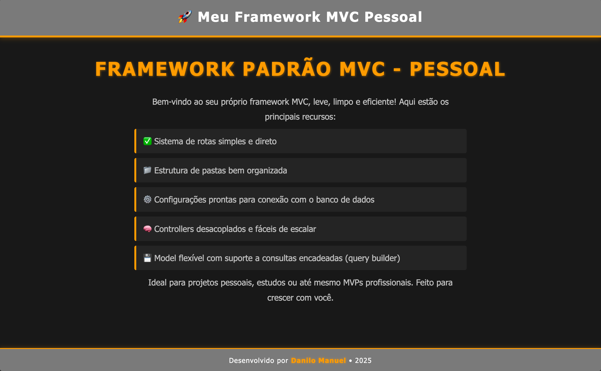

## Template para um simples framework MVC

- [x] Sistema de rotas

- [x]  Estrutura das pastas 

- [x]  Configurações preparadas para o BD

- [x]  Controllers

Depois é só entrar na pasta public e dar um `php -S localhost:8000`

